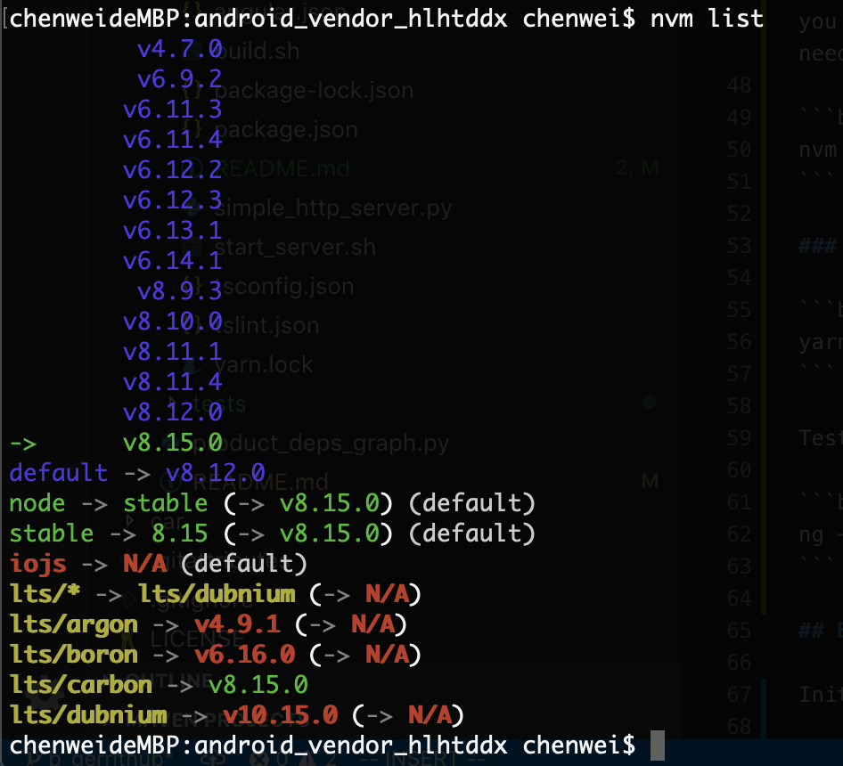

# Local Http Server and Web Frontend

Web frontend for debug product and module dependencies.

## Prepare environment

### Install [Yarn](https://yarnpkg.com/en/)

We use Yarn instead of NPM to manage node packages.

```bash
curl -o- -L https://yarnpkg.com/install.sh | bash
```

### Install [nvm](https://github.com/creationix/nvm)

```bash
curl -o- https://raw.githubusercontent.com/creationix/nvm/v0.33.11/install.sh | bash
```

Open a new terminal or `source ~/.bashrc` if you can not use `yarn --version` or `nvm --version`.

### Install [Node.js](https://nodejs.org/en/)

> Both the Angular CLI and generated project have dependencies that require Node 8.9 or higher, together with NPM 5.5.1 or higher.

```bash
nvm install --lts=carbon
```

**List your local installed node versions.**

```bash
nvm list
```



**Check your active node version.**

```bash
node --version
```

Set default node version. This step is optional, but it will make you happy that you don't need run `nvm use v8.15.0` every time you need that node version.

```bash
nvm alias default v8.15.0
```

### Install [Angular CLI](https://github.com/angular/angular-cli)

```bash
yarn global add @angular/cli
```

Test global `ng` command.

```bash
ng --version
```

## Build

> NOTE: you should setup and lunch Android development environment first before build frontend and start server for **$ANDROID_PRODUCT_OUT** environment variable is used in these helper scripts.

Initialize angular project.

```bash
cd localhttpserver
yarn install
```

This initializing work only has to be done once except project added new dependency package and you sync these changes to local. In this case you need to rerun `yarn install`.

```bash
./build.sh
```

> NOTE: rerun `yarn install` if build failed with missing packages.

## Start local server

> NOTE:
>
> - Build frontend project once before you lunch local http server.
> - Activate your Python environment before lunch local http server.

```bash
./start_server.sh
```

## Running unit tests

Run `ng test` to execute the unit tests via [Karma](https://karma-runner.github.io).

## Running end-to-end tests

Run `ng e2e` to execute the end-to-end tests via [Protractor](http://www.protractortest.org/).

## Further help

To get more help on the Angular CLI use `ng help` or go check out the [Angular CLI README](https://github.com/angular/angular-cli/blob/master/README.md).
